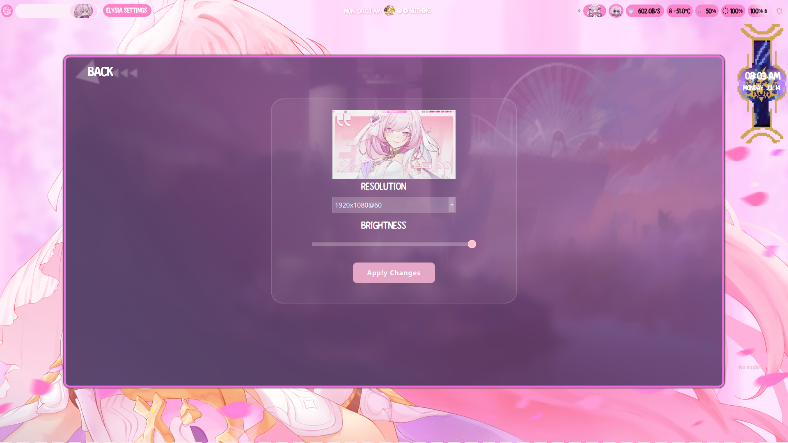

# 🌸 ElysiaOS Settings Manager 🌸

<h2> Light Theme</h2>
<table align="center">
  <tr>
    <td colspan="4"></td>
  </tr>
  <tr>
    <td colspan="1"></td>
    <td colspan="1"></td>
    <td colspan="1" align="center"></td>
    <td colspan="1" align="center"></td>
  </tr>
</table>

## Support and Donate

If you like my project, you can always support me via just a coffee and thank you so much ❤️ !

<h2> Installation</h2>
